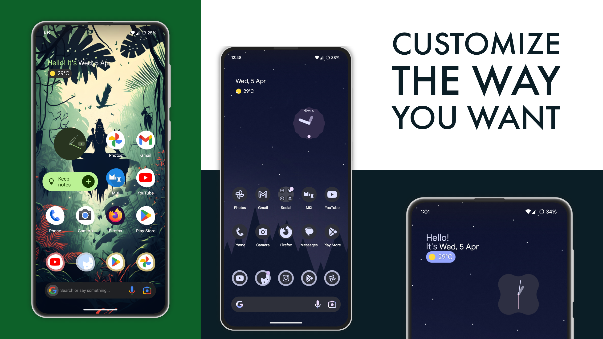
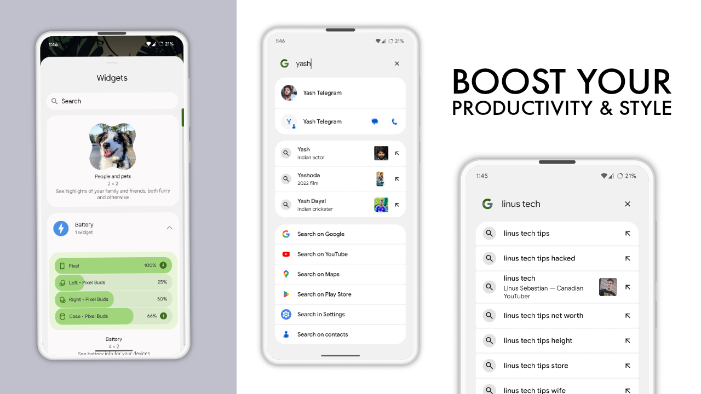
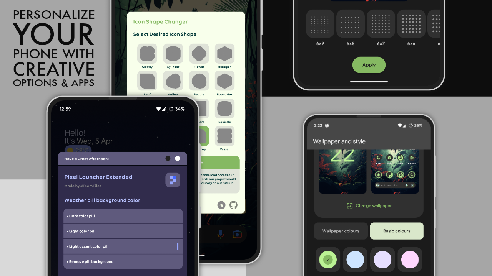
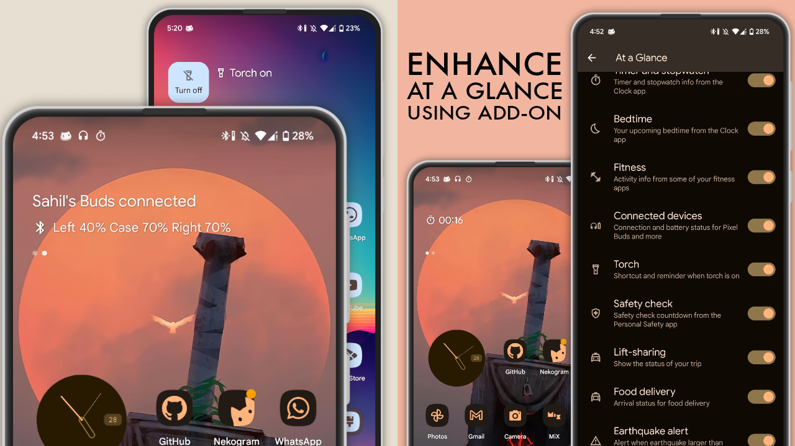
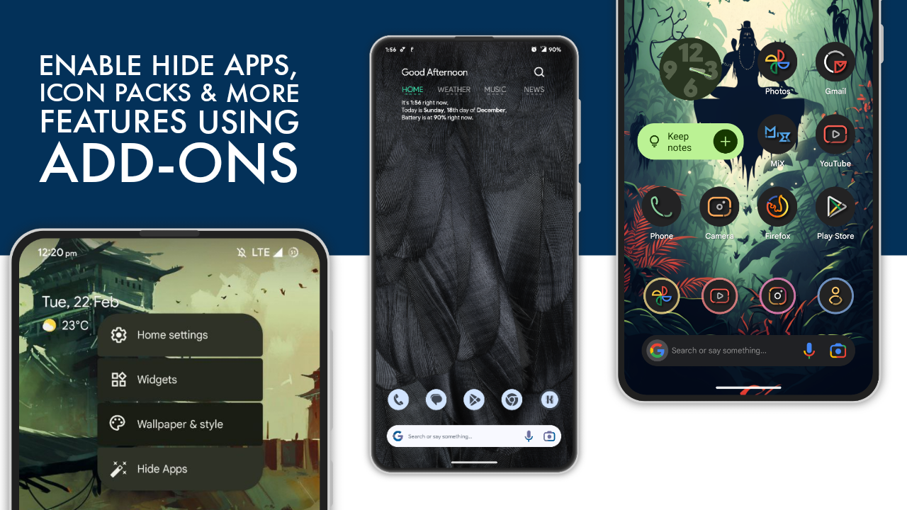
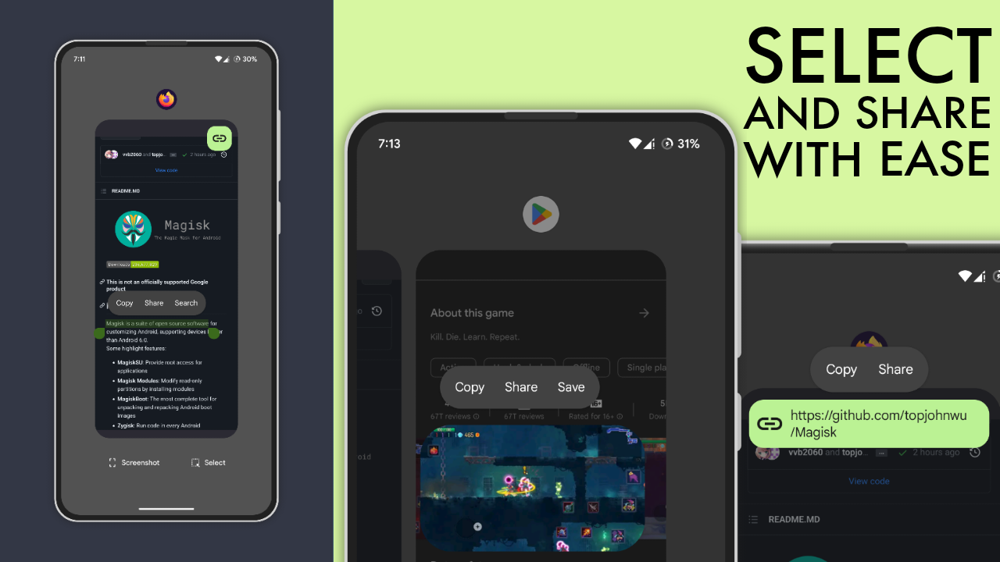

# Pixel Launcher Extended


**Pixel Launcher Extended** is a Magisk module by **TeamFiles** with many cool features compared to original Pixel Launcher by Google.

### Features
- Extra themed icons. Total of 1250+ icons.  
- More grids options, total of 14 grids. You can select these extra grids by going to **Wallpaper & style** > **App grid**. These are available for **Phones** only. Not available for **Tablets**.
- Double tap to sleep *(LSPosed required)*.
- You can choose different icons shapes using Icon Shape Changer app(It can be installed as a choice).
- Material You At A Glance greetings with Extended Settings app. Using this app you will be able to do some subtle modifications.
- [Pixel Launcher Mods](https://github.com/KieronQuinn/PixelLauncherMods) by KieronQuinn. It has many cool features such as icon pack changer, recent section blur, etc.
- Add-ons, which can enhance and add more functionality.
- Enable hidden flags & developer options.
> These flags can enable some subtle features & bring improvements in launcher. [Some of the flags usage with detailed explanation](https://sameerasw.notion.site/Pixel-Launcher-Flags-0068085015c646dda6210b02a6f719a9).
- And more!!

### Preview
<div align="center">
    
</div>
<div align="center">
    
</div>
<div align="center">
    
</div>
<div align="center">
    
</div>
<div align="center">
    
</div>
<div align="center">
    
</div>

### Compatibility
This module is expected to work on ROMs which are based on fairly unmodified Android source code.
- Android 13 AOSP-based ROMs
- Android 13 QPR AOSP-based ROMs
- Android 13 QPR2 AOSP-based ROMs
> Ensure your ROM is equipped with the necessary GApps, including Google apps and services. Without them, certain features may not function optimally on vanilla ROM. Make sure to flash proper GApps Package for your rom if you are using vanilla rom.

### Implement In Custom ROMs
If you wanna implement Pixel Launcher Extended in your custom rom then [visit here](https://github.com/StudioKeys/vendor_PixelLauncherExtended).

### Prerequisites
- Compatible ROMs (**AOSP-based custom ROMs** or **Google Pixel stock ROM**) based on Android 13.
- Device rooted by [Magisk latest stable](https://github.com/topjohnwu/Magisk/releases/latest).
> It is strongly advised to only use the official version of Magisk, as there have been reports from users of various issues such as bootloops and other problems when using unofficial forks of the software. Therefore, it is highly recommended that users only download and install Magisk from the official source to ensure the stability of Pixel Launcher Extended.
- [LSPosed](https://github.com/LSPosed/LSPosed) *(optional, if you want to use double tap to sleep feature)*

**Disclaimer**
- We **WON'T** be responsible if anything happens with your device. Bootloops are not expected, but you should always be prepared for the worst!

### Installation
- Uninstall any other launcher if you're using one. Only keep the default launcher
- Download the module installation file from [Download Links](#download-links) available
- Flash the file in Magisk and select your desired modifications using volume keys
- Reboot your device and go to **Settings** > **Apps** > **Default apps** > **Home app** and make sure **Pixel Launcher Extended** is selected

#### Variants
**Offline Installer**  
It doesn't require internet while flashing, but it's 100+ MB in size. It's available for download from [Download Links](#download-links) below. You can build it yourself too by following instructions from [Building from source](#building-from-source) section.

**Online Installer**  
It requires internet while flashing and downloads only selected files by user during installation. It's less than 5 MB in size. Depending upon your internet this variant may take more time in flashing compared to offline installer. It's available for download from [Download Links](#download-links) below. You can build it yourself too by following instructions from [Building from source](#building-from-source) section.

**Customize Installer**  
It's like offline installer but less in size. Installer zip size depends upon the modifications a user chooses while making the zip. It's not available for download from download links below. However, You can build it yourself by following instructions from [Building from source](#building-from-source) section. This variant is good for those whose phone's volume keys are broken or if they don't want to follow long instructions involving volume key presses(multiple times) while flashing in Magisk.

### Activating Double Tap to Sleep
- Make sure you installed DT2S while flashing the module(or selected it while making in case of customize installer).
- After rebooting device, open LSPosed and enable **Pixel Launcher DT2S**.
- Force-stop Pixel Launcher Extended from Settings (or reboot device again).
- Double-tap once on home screen. Grant superuser permissions and enjoy.

### Activating Developer Options In Launcher
- Go to phone's setting>About phone>Build number & tap it 7-8 times. This will enable launcher's developer options along with rom's developer option.

### Uninstallation
- Simply uninstall module from Magisk.

### Updating
- When there is new update available, simply flash newer version in Magisk without removing previous version.
- If you have flashed latest version already and want to select different choices while flashing, you can always flash module again without removing/uninstalling existing module.

### Add-ons
These are optional add-ons, they add extra functionality to Pixel Launcher Extended.

#### At A Glance Enhancer
This addon will enhance **At A Glance** and will enable new settings such as Doorbell, Timer, Stopwatch, Bedtime, Fitness tracker, Torch suggestion, Connected devices and much more.  
Made by [Pixelify](https://github.com/Kingsman44/Pixelify) developer, Kingsmanz. It also fixes the select feature, At A Glance weather if your ROM doesn't have proper GApps or due to some other reasons if you faced these issues.
- [Download](https://www.pling.com/p/1938895/) the magisk module.
- Flash in Magisk.
- Reboot device.
- Check out the new At A Glance settings. In most ROMs this will be the final step.
  * If you didn't get the new settings, then force-stop the Google app and reboot your device.
  * If you still didn't get those settings, uninstall updates of Google app and update from Play Store and reboot your device.

**Credits**
- Made by [Kingsmanz](https://github.com/Kingsman44)
- [GitHub](https://github.com/Kingsman44/At-A-Glance-Enhancer)
- [Video showcase](https://graph.org/file/5cd90b41ec3563e69c62f.mp4)
- [Screenshots](https://graph.org/At-A-Glance-Enhancer-Screenshots-11-16)

#### Quick Opener
An add-on for Pixel Launcher running on **Android 13 QPR2**. This add-on enables a quick launch feature on pixel launcher's searchbar.
- [Download](https://www.pling.com/p/2019569/) the magisk module.
- Flash in Magisk.
- Reboot device.
- Check for the feature. If the feature doesn't appear then force stop launcher once.

**Credits**
- Made by [saitamasahil](https://github.com/saitamasahil)
- [GitHub](https://github.com/saitamasahil/QuickOpener)

#### Hide Apps Feature
You can enable the hide app feature in Pixel Launcher Extended by using a third-party app called **Pixel Mods**. *(**LSPosed** is required for this add-on)*.
- Install the [Pixel Mods App](https://play.google.com/store/apps/details?id=com.metris.xposed.pmods).
- Open LSPosed and click **Pixel Mods** from modules section. Toggle **Enable Module** and make sure **Pixel Launcher** has ticked.
- Reboot device.
- Check out the **Hide Apps Feature** by pressing hold on empty space on home screen.

#### Wallpaper Zoom Effect Enabler & Disabler
If you want to enable or disable wallpaer zoom effect then use this add-on.
- [Download](https://index.teamfiles.workers.dev/0:/WallZoomAddon/) the magisk module.
- Flash in Magisk.
- Reboot device.

**Credits**
- [xdsolraC](https://telegram.me/xdsolraC)

## Download Links
- [Mirror 1](https://www.pling.com/p/1952604)
- [Mirror 2](https://store.kde.org/p/1952604)
- [Mirror 3](https://www.opendesktop.org/p/1952604)

## Building from source

If you don't want to download built module from mirrors above, then you can build magisk module yourself using PLE Builder. You can run PLE Builder in Linux based distros & Termux(F-Droid version). This is one time process & It installs PLE Builder into your system. You can run or update the builder in future by typing **PLE** in your Terminal/Termux & selecting **Update PLE Builder** option.

### Install & run PLE Builder in Ubuntu, Debian, and other Linux distributions
- Clone the repo using git.
```sh
git clone --depth=1 https://github.com/saitamasahil/Pixel-Launcher-Extended
```
- Navigate to the **Pixel-Launcher-Extended** folder.
```sh
cd Pixel-Launcher-Extended
```
- To install PLE Builder type this command.
```sh
chmod +x builder_dependencies.sh && ./builder_dependencies.sh
```
- Once you see the installation success message, exit the terminal and restart it. Then, use the 'PLE' command to launch PLE Builder.
- Choose desired option using number keys.
- To run PLE Builder again, Type **PLE** or **ple** in Terminal.

### Install & run PLE Builder in Termux
- Open Termux, copy & paste this command:
```sh
termux-setup-storage
```
and give Termux storage access. If you get this warning "It appears that directory '~/storage' already exists. This script is going to rebuild its structure from scratch, wiping all dangling files. The actual storage content is not going to be deleted" then just do press "y". It won't do any harm to your device.
- Now copy & paste these commands to install PLE Builder.
```sh
pkg update && pkg upgrade
pkg install -y git
rm -rf Pixel-Launcher-Extended
git clone --depth=1 https://github.com/saitamasahil/Pixel-Launcher-Extended
cd Pixel-Launcher-Extended
chmod +x builder_dependencies.sh && ./builder_dependencies.sh
```
- Once you see the installation success message, exit the termux and restart it. Then, use the 'PLE' command to launch PLE Builder.
- Please make sure to grant storage permissions.
- Choose desired option using number keys.
- Use **Move Magisk Module To Internal Storage** option to move magisk module to Phone's Internal Storage after making it.
- Use [Termux From F-Droid](https://f-droid.org/en/packages/com.termux/) to perform these tasks.
- To run PLE Builder again, Type **PLE** or **ple** in Terminal.

## Troubleshooting
If you face any issues while using Pixel Launcher Extended then look into this section first before asking in support group on Telegram.

### Weather widget in At A Glance or Select feature in recent tabs not working
Try updating Google App, Google Play Services, Android System Intelligence (ASI), Android System Webview, Google Calendar, Google Lens and all other Google apps from Play Store. We suggest you to use ROMs that have stock Pixel GApps by default.
After trying above solution if it still doesn't work or if you are facing random crashes in launcher then download [At A Glance Enhancer add-on](#at-a-glance-enhancer). It contains Android System Intelligence (which may fix all these issues).

### Material You isn't working properly, it's not changing color according to wallpaper
Your ROM may have its own implementation of Material You and that may be interfering with Pixel Launcher Extended. Although we have implemented fix for this within launcher, It is possible that you may still face this issue.

To fix this issue, please follow these steps:
- [Download Termux](https://f-droid.org/en/packages/com.termux/)
- Open it and type the command given below and press enter
```sh
su -c settings delete secure theme_customization_overlay_packages
``` 
- Grant superuser permissions
- Don't reboot as after reboot you will have to apply these changes again(blame your rom)

### Enabled “Hide Clock” from the Pixel Launcher Mods app and now the clock isn't returning
[Watch this video](https://index.teamfiles.workers.dev/0:/clock%20fix.mp4) for instructions to fix this issue.

### Pixel Launcher Mods stucked at loading screen or showing error
Force-stop the app and relaunch.

### Pixel Launcher Extended crashes while going to recent tab
Turn off **Overview suggestions** from Pixel Launcher Extended's settings.

### Quick Search Bar not opening
Make sure your rom has proper GApps. Also if your rom doesn't have Google App then download it from play store.

### Pixel Launcher Extended is not showing in default home settings or no launcher showing after flashing PLE
Uninstall updates of the Pixel Launcher app and reboot your device. Make sure PLE isn't in magisk's deny list.

## Donation Links
If you have found this project helpful and would like to support its ongoing development, please consider making a donation. Your support is greatly appreciated and will help to ensure that this project can continue to be maintained and improved.

Thank you for your generosity!
- [Paypal](https://www.paypal.com/paypalme/sahilsaitama96)
- UPI(Google Pay): `sahilmanchanda1996@okaxis`

## Credits/Thanks
- Google
- [LiArch55](http://telegram.me/LiArch55)
- [saitamasahil](https://github.com/saitamasahil)
- [iamlooper](https://github.com/iamlooper/)
- [KieronQuinn](https://github.com/KieronQuinn)
- [uragiristereo](https://github.com/uragiristereo)
- [Monet Icons Team](https://teamfiles.github.io/about_monet-team.html)
- [siavash79](https://github.com/siavash79)
- [Kingsman44](https://github.com/Kingsman44)
- [anarchist22](https://telegram.me/anarchist22)
- [WaifuPX-DG](https://github.com/WaifuPX-DG)
- [LawnchairLauncher](https://github.com/LawnchairLauncher)
- [RadekBledowski](https://github.com/RadekBledowski)
- [PalmDevs](https://github.com/PalmDevs)
- [agam778](https://github.com/agam778)
- [atharvap8](https://github.com/atharvap8)
- [jaaat4u](https://github.com/jaaat4u)
- [selfmusing](https://github.com/selfmusing)
- [Sameera](https://telegram.me/sameera_s_w)
- [naokoshoto](https://github.com/naokoshoto)

Brought to you by [TeamFiles](https://github.com/TeamFiles)!


## Contact us
[](https://telegram.me/filesfederation)

[](https://telegram.me/modulesrepo)

[](https://telegram.me/fileschat)
